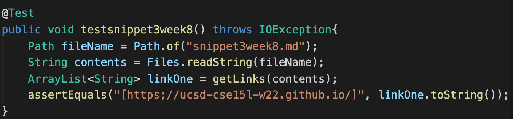

# CSE15L WEEK8 LAB REPORT
## By Guanyu Zhu 

- Snippet 1
```
[a link`](url.com)

[another link](`google.com)`

[`cod[e`](google.com)

[`code]`](ucsd.edu)   
```


The test did not meet expected output```[`google.com, google.com, ucsd.edu]```. Instead, the output is ```[[url.com, ]`google.com, google....```
Change need to make: Modification can be within 10 lines of code. By using for-loops and if statement, we are able to identify backticks.
Iterating through md file, we are able to get rid off the effect by backticks.

- Snippet 2
```
[a [nested link](a.com)](b.com)

[a nested parenthesized url](a.com(()))

[some escaped \[ brackets \]](example.com)
```


The test did not meet the expected output```[a.com, a.com(()), example.com]```. Instead, the output is ```a.com, a.com(([], example.com]```
Change need to make: Modification can be within 10 lines of code. By using additional statment to identify the first ```[``` or ```(```. 
- Snippet 3
```
[this title text is really long and takes up more than 
one line

and has some line breaks](
    https://www.twitter.com
)

[this title text is really long and takes up more than 
one line](
    https://ucsd-cse15l-w22.github.io/
)


[this link doesn't have a closing parenthesis](github.com

And there's still some more text after that.

[this link doesn't have a closing parenthesis for a while](https://cse.ucsd.edu/


)

And then there's more text
```



The test did not meed expect output```[https;//ucsd-cse15l-w22.github.io/]```. Instead, the test enter a inifinite loop
Change need to make: Modification can be within 10 lines of code. We can identify new lines which we have already used in the code and let it check all the lines. Once it find```[``` or ```(```, we can let it continue the process until everything is scanned

---
- Snippet 1,2,3 for group reviewed
- Test

- Snippet 1

- Snippet 2

